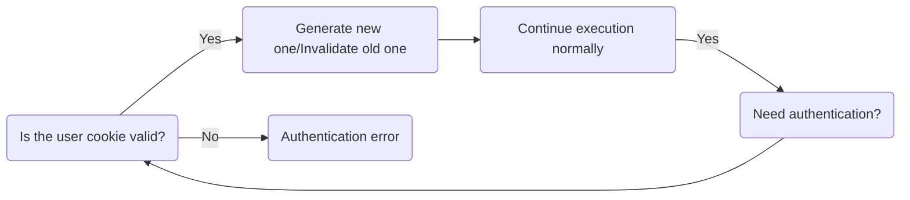

# SUK - Single-use Keys

What if, instead of storing user information on the client side in a JWT token, you used a token with a randomized session ID that has high entropy? This token would only be valid for a short duration and expire immediately after use, enhancing security and minimizing the risk of unauthorized access.

## Decisions

- Multiple cookies can connect to a single session, but they are not aware of each other
- If all cookies to a session are used up, the reference to the session is lost

## Roadmap

- [x] Make implementation concurrent-safe
- [ ] Use better algorithm for random and strong keys (refer to [this](https://stackoverflow.com/questions/22892120/how-to-generate-a-random-string-of-a-fixed-length-in-go))
