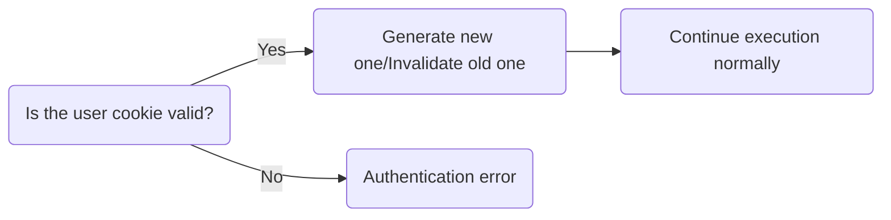

# SUCKS - Single Use Cookies (Killer Security)

What if instead of storing user info on the server side, in a JWT token, a token with a randomized session ID (with pretty good entropy) was used, expiring as soon as it was needed.

## Decisions

- Multiple cookies can connect to a single session, but they are not aware of each other
- If all cookies to a session are used up, the reference to the session is lost

## Roadmap

- [ ] Make implementation concurrent-safe
- [ ] Use better algorithm for random and strong keys (refer to [this](https://stackoverflow.com/questions/22892120/how-to-generate-a-random-string-of-a-fixed-length-in-go))
